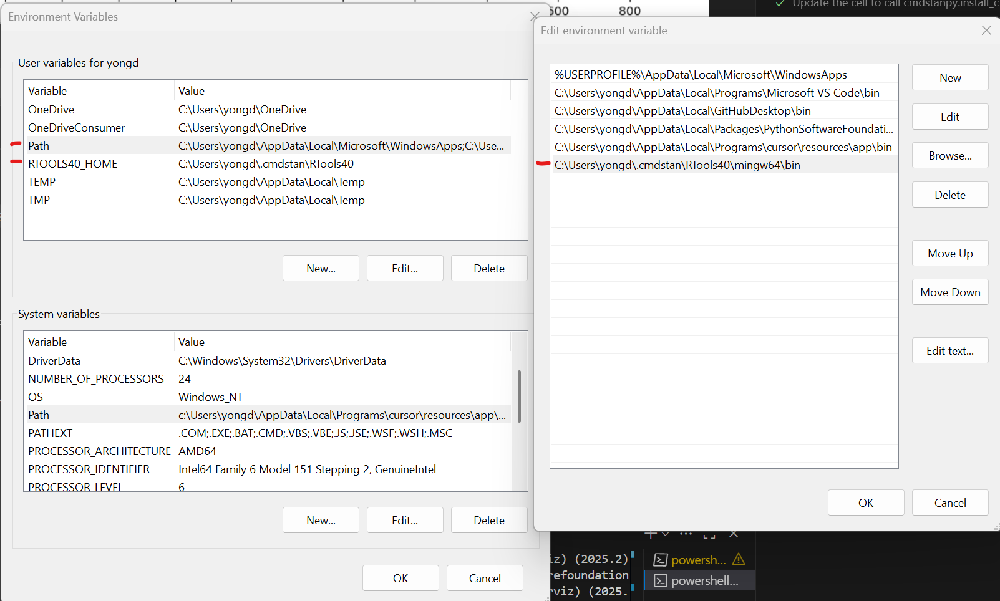

# Bayesian Statistical Modeling with Stan, R, and Python
- Kentaro Matsuura (2023). Bayesian Statistical Modeling with Stan, R, and Python. Singapore: Springer.
- URL: https://link.springer.com/book/10.1007/978-981-19-4755-1
- URL: https://www.amazon.com/dp/9811947546/

## Eratta
[here](errata.md)

## Tested Environment
| Software/Package Name | Version (publication) | Version (now) |
|:-----------|:------------|:------------|
| OS | Windows 11 (64bit) | Windows 11 (64bit) |
| Stan | 2.29.2 | 2.31.0 |
| R | 4.1.3 | 4.2.2 |
| cmdstanr | 0.5.0 | 0.5.3 |
| Python | 3.10.6 | 3.11.0 |
| cmdstanpy | 1.0.1 | 1.1.0 |


## Install cmdstanpy

This installation must be done only ONCE.
To run `run-model4-4.py`:
### Windows 10/11
1. Install `cmdstanpy`
    ```
    > pip install cmdstanpy
    ```
2. Install c++ compiler for Stan
    ```
    > python
    Python 3.12.10 (tags/v3.12.10:0cc8128, Apr  8 2025, 12:21:36) [MSC v.1943 64 bit (AMD64)] on win32
    Type "help", "copyright", "credits" or "license" for more information.
    >>> import cmdstanpy
    >>> cmdstanpy.install_cmdstan(compiler=True)
    CmdStan install directory: C:\Users\yongd\.cmdstan
    CmdStan version 2.36.0 already installed
    Test model compilation
    ```
3. Check the Environment Variables: PATH
    

    - The installation path may be different. So you must check the output message from `cmdstanpy.install_cmdstan(compiler=True)` shown above.

### Mac OS 
1. Install `XCode`
2. Install `cmdstanpy`
3. No need to install a c++ compiler for Stan. It is included in `XCode`

### LINUX
1. Install `cmdstanpy`
That's it because LINUX has a C++ compiler installed automatically.